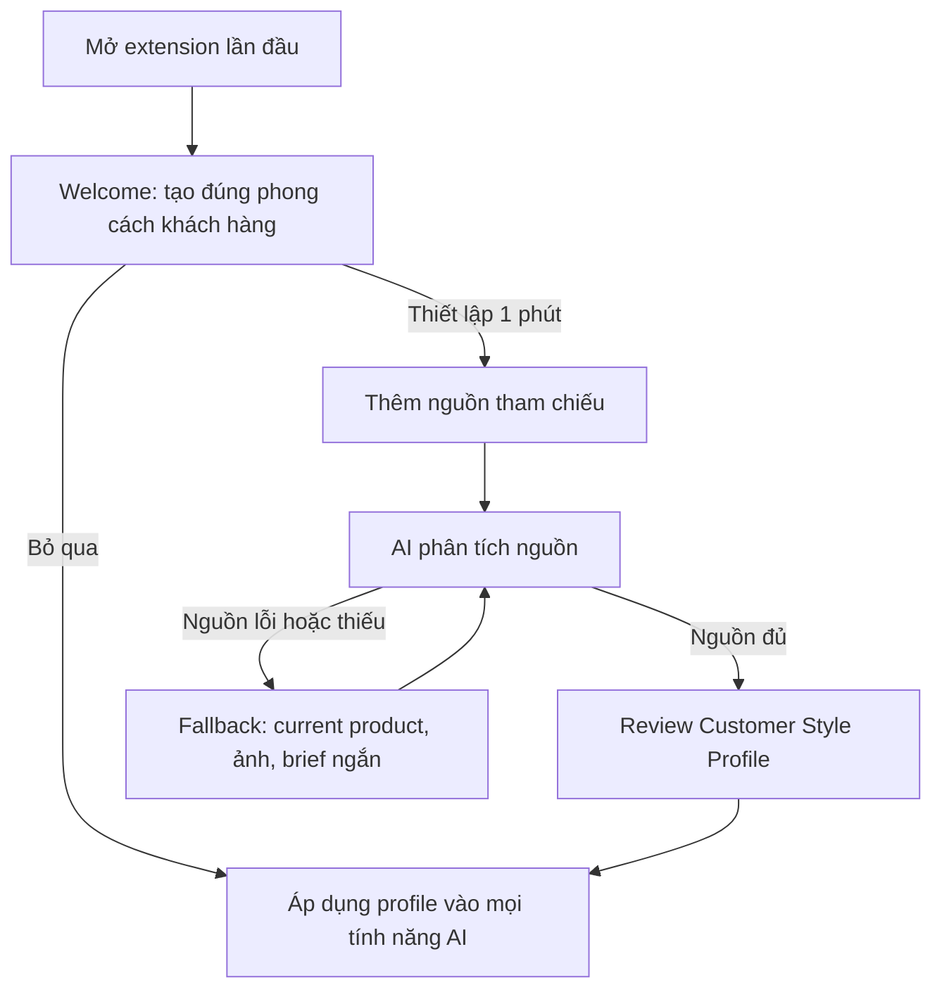

# Research & Design Proposal: Customer Style Onboarding

## Summary

Đề xuất thêm onboarding lần đầu để extension học phong cách của khách hàng từ ví dụ thật, sau đó tái sử dụng profile này cho:

- AI viết title, description, short description, SEO title, SEO description.
- AI Suggest preset cho lifestyle mockup.
- Prompt tạo ảnh lifestyle mockup.
- Các chức năng AI mới sau này.

Khuyến nghị: **onboarding ngắn, có thể bỏ qua, ưu tiên 1-3 product URLs; AI phân tích rồi cho người dùng duyệt profile trước khi áp dụng**. Không bắt người dùng hoàn thành một form dài ngay lần đầu mở extension.

MVP không nên xin quyền đọc mọi website. Dùng Gemini URL Context cho URL public; fallback bằng dữ liệu sản phẩm BurgerPrints đang mở, ảnh tham chiếu và mô tả ngắn.

## Scope

### Mục tiêu

- Thiết lập trong khoảng 1-2 phút.
- Tạo được customer style profile đủ tốt từ input ít.
- Giữ user control: luôn cho xem, sửa và tắt profile.
- Một seller có thể phục vụ nhiều khách hàng, vì vậy data model phải hỗ trợ nhiều profile dù MVP chỉ cần một active profile.

### Không thuộc MVP

- Crawl toàn bộ website/catalog.
- Fine-tune model riêng.
- Tự động học âm thầm từ mọi thao tác.
- Đồng bộ cloud hoặc chia sẻ profile giữa team.
- Cam kết đọc được mọi URL.

## Current Product Findings

- Side panel hiện luôn mở tab Generate và tải API key, settings, product data, history.
- AI Suggest đang phân tích riêng từng sản phẩm và cache theo product fingerprint.
- Quick Generate và AI viết nội dung dùng cùng Gemini service/offscreen runner.
- Product data hiện có title, descriptions, product type, colors, design image và mockup images.
- Settings lưu bằng `chrome.storage.local`; profile dạng JSON nhỏ phù hợp quota hiện tại.
- Extension chỉ có host permission cho BurgerPrints và Gemini API.

Khoảng trống chính: chưa có context bền vững mô tả audience, copy voice, visual direction, rules và defaults của từng khách hàng.

## Research Findings

### Pattern thị trường

- Công cụ ecommerce hiện đại cho phép paste product URL để tạo content và visual direction.
- Brand voice chất lượng cao học từ PDP/listing/campaign thật, không chỉ từ các tính từ như “professional” hoặc “playful”.
- Người dùng vẫn cần chỉnh voice/rules sau khi AI suy luận.
- Profile nên cải thiện từ feedback/edits, nhưng cơ chế học tự động nên để sau MVP.

### Technical feasibility

- Gemini URL Context có thể xử lý tối đa 20 public URLs/request.
- URL Context không đọc được localhost, private network hoặc URL không public.
- URL Context có thể dùng cùng structured output để trả về profile JSON ổn định.
- Chrome khuyến nghị optional permissions cho tính năng tùy chọn và chỉ request trong user gesture.
- `chrome.storage.local` có quota 10 MB; chỉ lưu profile JSON và source metadata, không lưu bản sao ảnh nguồn.

### Hard truths

- “Tự động lấy tất cả thông tin cần thiết từ link” không thể đảm bảo. Trang dynamic, login-only, bot protection hoặc thiếu nội dung sẽ tạo profile kém.
- Modal onboarding bắt buộc trước khi thấy giá trị sẽ làm tăng abandonment.
- Một URL thường chỉ phản ánh một sản phẩm, không đủ để suy luận chính xác brand voice. Nên khuyến nghị 3 sản phẩm tiêu biểu.
- AI inference phải được xem là draft có confidence, không phải sự thật tuyệt đối.

## Evaluated Approaches

| Approach | UX | Chất lượng | Rủi ro | Đánh giá |
|---|---|---:|---|---|
| Form thủ công dài | Nhiều câu hỏi về tone, audience, style | Trung bình | Friction cao, input chung chung | Không chọn |
| Chỉ paste URLs | Rất nhanh | Tốt khi URL public/chất lượng | Fail với trang block/dynamic; thiếu user control | Không đủ |
| Hybrid progressive profile | URLs trước; fallback current product, ảnh, text; AI draft + user review | Cao nhất | Cần thêm UI/profile schema | **Khuyến nghị** |

## Recommended UX

### Nguyên tắc

- Onboarding xuất hiện lần đầu nhưng **có nút Bỏ qua rõ ràng**.
- Chỉ hỏi input cần thiết để tạo giá trị đầu tiên.
- Advanced inputs ẩn sau “Thêm thông tin”.
- Phân tích xong phải hiện “AI đã học được gì” để sửa nhanh.
- Sau onboarding, profile luôn có thể đổi từ Settings và bằng active-profile chip trên Generate.

### First-run flow



### Screen 1: Value proposition

Nội dung ngắn:

> Cho AI xem 1-3 sản phẩm tiêu biểu. Extension sẽ học cách viết nội dung và phong cách ảnh để các kết quả sau phù hợp khách hàng hơn.

Actions:

- Primary: `Thiết lập trong 1 phút`
- Secondary: `Bỏ qua, dùng mặc định`
- Link nhỏ: `Dữ liệu nào được sử dụng?`

Không hỏi API key ở màn hình này. Nếu chưa có key, xin key sau khi user bấm Analyze, đúng thời điểm cần.

### Screen 2: Add references

Default chỉ hiện một chip-input nhiều dòng:

- Label: `Link sản phẩm tiêu biểu`
- Hint: `Khuyên dùng 3 link có nội dung và hình ảnh đúng phong cách nhất`
- Paste nhiều URL; Enter tạo chip; validate URL ngay.
- CTA phụ: `Dùng sản phẩm BurgerPrints đang mở`.

Progressive section `Thêm thông tin để kết quả chính xác hơn`:

- Upload hoặc chọn 3-8 ảnh tham chiếu.
- Brief một câu: khách hàng mục tiêu, điểm khác biệt, điều cần tránh.
- Chọn ngôn ngữ nội dung chính.

Không bắt người dùng chọn thủ công scene, lighting, tone, audience ở bước này.

### Screen 3: Analyze

Hiện progress theo nguồn, không dùng spinner vô nghĩa:

- Đọc nội dung và ảnh sản phẩm.
- Nhận diện phong cách viết.
- Nhận diện phong cách hình ảnh.
- Tạo đề xuất mặc định.

Mỗi URL có trạng thái `Đã đọc`, `Thiếu dữ liệu`, `Không thể truy cập`. Cho phép tiếp tục nếu ít nhất một nguồn dùng được.

### Screen 4: Review profile

Hiện summary dạng editable cards:

- `Khách hàng mục tiêu`
- `Giọng văn & cấu trúc nội dung`
- `Phong cách hình ảnh`
- `Mockup defaults`
- `Luôn dùng / Không được dùng`

Mỗi card hiển thị confidence: `Cao`, `Trung bình`, `Cần bổ sung`. User sửa bằng chips/select/text ngắn, không chỉnh JSON.

Actions:

- Primary: `Lưu và áp dụng`
- Secondary: `Phân tích lại`
- Link: `Bỏ qua profile này`

### Returning-user UX

- Header Generate có active-profile chip: `Phong cách: Acme ▼`.
- Chip cho phép đổi, tạo mới, chỉnh sửa hoặc tắt profile cho sản phẩm hiện tại.
- Settings có section `Customer Style Profiles`.
- Nếu chưa có profile, hiển thị một banner nhẹ sau khi user đã tạo kết quả đầu tiên, không mở lại modal liên tục.

## Profile Schema

```json
{
  "version": 1,
  "id": "profile_uuid",
  "name": "Customer name",
  "status": "ready",
  "sources": [
    {
      "type": "url|current_product|image|brief",
      "value": "source reference",
      "status": "used|partial|failed"
    }
  ],
  "audience": {
    "summary": "",
    "markets": [],
    "interests": []
  },
  "copyStyle": {
    "language": "en",
    "tone": [],
    "titlePatterns": [],
    "descriptionStructure": [],
    "preferredTerms": [],
    "bannedTerms": [],
    "claimsPolicy": []
  },
  "visualStyle": {
    "summary": "",
    "moods": [],
    "palette": [],
    "scenes": [],
    "photographyStyles": [],
    "lighting": [],
    "composition": [],
    "modelDirection": [],
    "avoid": []
  },
  "mockupDefaults": {
    "countries": [],
    "style": "",
    "scenes": [],
    "displayMode": "",
    "cameraAngle": "",
    "lighting": "",
    "additionalPrompt": ""
  },
  "confidence": {
    "overall": 0,
    "copyStyle": 0,
    "visualStyle": 0
  },
  "createdAt": 0,
  "updatedAt": 0
}
```

Lưu source metadata và profile đã tóm tắt; không lưu full HTML hoặc ảnh remote.

## AI Analysis Design

### Input priority

1. 1-3 product URLs tiêu biểu.
2. BurgerPrints product đang mở.
3. Ảnh tham chiếu.
4. Brief/rules do user nhập.

Brief/rules do user nhập luôn có độ ưu tiên cao hơn AI inference.

### Output rules

- Trả structured JSON đúng schema.
- Phân biệt `observed` và `inferred`.
- Không suy luận claim, certification, demographic nhạy cảm hoặc trademark policy nếu không có bằng chứng.
- Trả confidence theo từng nhóm.
- Gắn source evidence ngắn cho các quyết định quan trọng để hỗ trợ review.

### Profile application

- `generateProductListing`: thêm copyStyle, audience và rules.
- `suggestSettings`: thêm visualStyle + mockupDefaults, nhưng vẫn ưu tiên tính phù hợp của sản phẩm hiện tại.
- `generateMockup`: thêm visual direction và avoid rules; không được làm yếu các rule bảo toàn design/brand safety.
- Quick Generate: dùng active profile tự động.
- Người dùng có thể disable profile cho từng run.

Thứ tự ưu tiên prompt:

1. Safety và product-preservation rules.
2. User override cho run hiện tại.
3. Active customer profile.
4. Product-specific AI Suggest.
5. Global defaults.

## Technical Recommendation

### MVP architecture

- Thêm `customerProfiles`, `activeCustomerProfileId`, `onboardingState` vào `chrome.storage.local`.
- Thêm profile methods vào storage service.
- Thêm một Gemini analysis method dùng URL Context + structured output.
- Chạy analysis qua offscreen runner để không phụ thuộc vòng đời side panel.
- Truyền active profile vào ba luồng AI hiện tại.
- Không thêm broad host permission ở MVP.

### URL acquisition strategy

**Khuyến nghị MVP:** để Gemini URL Context đọc URL public. Ưu điểm: không cần extension tự fetch/crawl mọi domain, không cần quyền `<all_urls>`.

Fallback:

- Current BurgerPrints product data đã extract được.
- User-provided images.
- User brief.
- Báo rõ URL nào không đọc được.

Chỉ cân nhắc optional host permissions ở phase sau, khi có bằng chứng URL Context fail thường xuyên trên các domain khách hàng thực tế. Permission phải xin sau click và theo từng origin, không xin quyền toàn web ngay khi cài.

## Phasing

### Phase 1: MVP

- Skippable first-run onboarding.
- Một active profile, schema hỗ trợ nhiều profile.
- URL + current product + brief.
- Review/edit summary.
- Áp dụng vào listing, AI Suggest, mockup, Quick Generate.

### Phase 2: Quality

- Upload/chọn ảnh reference tốt hơn.
- Multiple profiles UI.
- Source refresh và stale indicator.
- Feedback sau generation: `Đúng phong cách / Chưa đúng`.

### Phase 3: Learning

- Gợi ý cập nhật profile từ các chỉnh sửa được user chấp thuận.
- Import CSV/catalog.
- Sync/team profile nếu có backend.

## Risks & Mitigations

| Risk | Mitigation |
|---|---|
| URL không đọc được | Fallback current product/image/brief; status từng URL |
| AI suy luận sai style | Review screen, confidence, editable cards |
| Onboarding làm chậm activation | Skippable, tối đa 4 screens, chỉ một input chính |
| Profile làm giảm product relevance | Product-specific AI Suggest vẫn có quyền điều chỉnh |
| Prompt quá dài/tốn chi phí | Lưu summary có giới hạn, không chèn raw source mỗi run |
| Nhiều khách hàng bị trộn style | Profile tách riêng, active-profile indicator rõ |
| Data nhạy cảm | Local-only MVP; không lưu raw HTML/ảnh; mô tả rõ dữ liệu gửi Gemini |

## Success Metrics

- >= 60% user mới bắt đầu onboarding.
- >= 70% người bắt đầu hoàn tất profile.
- Median setup time <= 2 phút.
- >= 80% profile analysis có ít nhất một source thành công.
- Giảm số lần user sửa thủ công title/description và mockup settings.
- Tăng tỷ lệ chấp nhận AI Suggest/preset và kết quả Quick Generate.
- Tỷ lệ user disable profile cho từng run thấp.

## Validation Criteria

- First run có thể bỏ qua và dùng toàn bộ chức năng cũ.
- Không hiển thị onboarding lại sau khi completed/skipped, trừ khi user chủ động mở.
- URL lỗi không làm mất toàn bộ analysis nếu còn source tốt.
- Profile review luôn editable trước khi áp dụng.
- Profile được áp dụng nhất quán vào listing, suggest, mockup và quick flow.
- Tắt profile trả hành vi về defaults hiện tại.
- Không thêm quyền host rộng trong MVP.

## Recommended Decision

Chọn **Hybrid progressive profile onboarding**.

Lý do:

- Input chính đơn giản nhất: paste 1-3 links.
- Chất lượng cao hơn form tính từ thủ công.
- Có fallback thực tế cho URL không đọc được.
- Không phá workflow hiện tại.
- Data model đủ cho seller nhiều khách hàng mà không over-engineer MVP.

## Unresolved Questions

1. MVP hiển thị nhiều profile ngay từ đầu hay chỉ một active profile và giấu quản lý nhiều profile đến Phase 2?
2. Có cho phép user bỏ qua API key và chỉ lưu draft sources để phân tích sau không?
3. Customer profile mặc định áp dụng cho mọi product hay extension nên yêu cầu xác nhận khi mở product mới?

## Sources

- [Gemini URL Context](https://ai.google.dev/gemini-api/docs/url-context)
- [Gemini Structured Output](https://ai.google.dev/gemini-api/docs/structured-output)
- [Chrome Optional Permissions](https://developer.chrome.com/docs/extensions/reference/api/permissions)
- [Chrome Storage API](https://developer.chrome.com/docs/extensions/reference/api/storage)
- [Hypotenuse AI Brand Voice](https://www.hypotenuse.ai/features/brand-voice)
- [ProductPage.ai URL-to-product-page flow](https://www.productpage.ai/)
